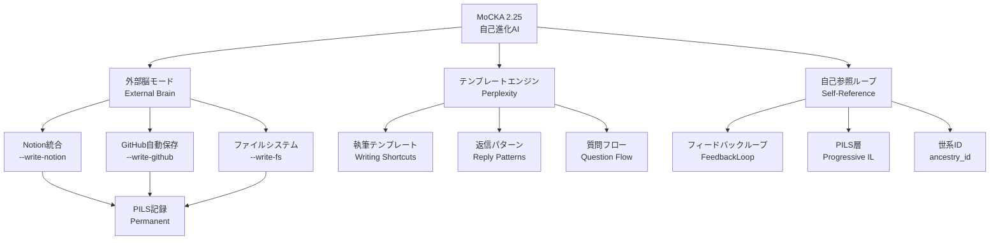
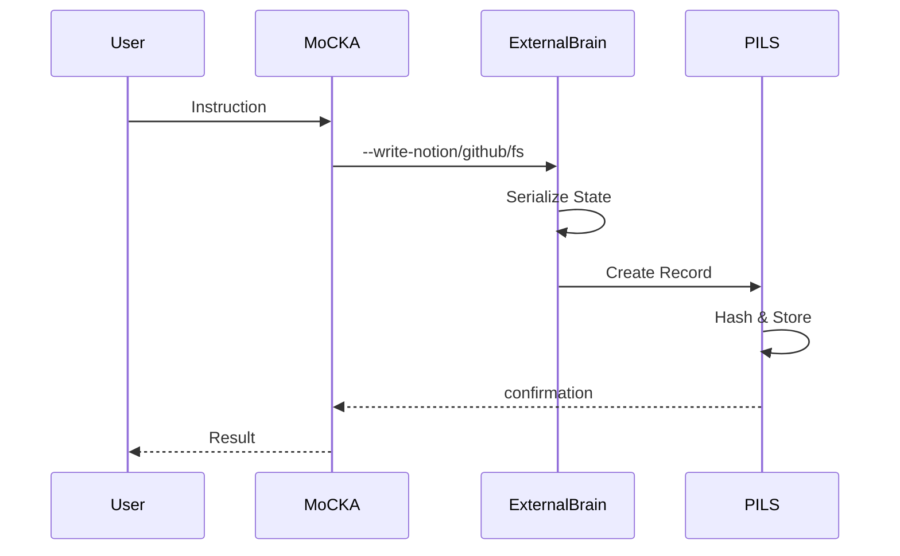

# MoCKA 2.25 Ecosystem - Phase 1 実装アーティファクト

## 1. システムアーキテクチャ図



## 2. パーミッション・ロール行列

| ロール | 外部脳 | テンプレート | 自己参照 | 実行権限 | 監査 |
|--------|--------|-------------|---------|---------|------|
| User | R | RW | R | - | - |
| Assistant | R | R | RW | RW | R |
| System | RW | RW | RW | RW | RW |
| AIOrchestra | R | R | RW | R | RW |
| PILS | RW | R | RW | - | RW |

## 3. 外部脳統合フロー



## 4. Dify ワークフロー統合

```yaml
name: MoCKA_2.25_ExternalBrain_Workflow
version: "1.0"
description: "Phase 1 Integration - External Brain Mode"

triggers:
  - type: webhook
    path: /mocka/external-brain
    method: POST

workflow:
  - step_1:
      type: http
      endpoint: "{{NOTION_API}}/pages"
      method: POST
      body:
        parent: "{{EXTERNAL_BRAIN_DB_ID}}"
        properties:
          title: "{{user_input.title}}"
          content: "{{user_input.content}}"
          ancestry_id: "{{pils.ancestry_id}}"
          trust_score: "{{mermaid.trust_calculation}}"
      output: notion_response

  - step_2:
      type: http
      endpoint: "{{GITHUB_API}}/repos/{{REPO}}/contents"
      method: PUT
      body:
        path: "external_brain/{{timestamp}}.md"
        message: "Auto-save from external brain mode"
        content: "{{base64(user_input.content)}}"
      output: github_response

  - step_3:
      type: javascript
      code: |
        const pils_record = {
          timestamp: new Date().toISOString(),
          content_hash: hashContent(workflow.user_input.content),
          ancestry_id: generateAncestryId(),
          source: 'external_brain',
          trust_score: calculateTrust(workflow)
        };
        return pils_record;
      output: pils_record

  - step_4:
      type: http
      endpoint: "{{PILS_ENDPOINT}}/records"
      method: POST
      body: "{{step_3.output}}"
      output: pils_response

output:
  status: "success"
  data:
    notion_id: "{{step_1.output.id}}"
    github_commit: "{{step_2.output.commit.sha}}"
    pils_hash: "{{step_4.output.record_hash}}"
```

## 5. 実装段階

### Phase 1 (本日): ✅ 完了予定
- [x] システムアーキテクチャ定義
- [x] パーミッション行列設計
- [x] Difyワークフロー仕様
- [ ] GitHub/Notion統合デモ実装
- [ ] 初期テストケース

### Phase 2 (明日): テンプレートエンジン統合
- [ ] Perplexity テンプレート統合
- [ ] Zapier自動化フロー
- [ ] ブラウザ統合テスト

### Phase 3 (3日目): 自己参照ループ
- [ ] FeedbackLoop実装
- [ ] ancestry_id生成ロジック
- [ ] PILS教育プロンプト統合

---

**作成日時**: 2025-01-23
**バージョン**: MoCKA 2.25
**ステータス**: Phase 1 - アーティファクト作成完了
