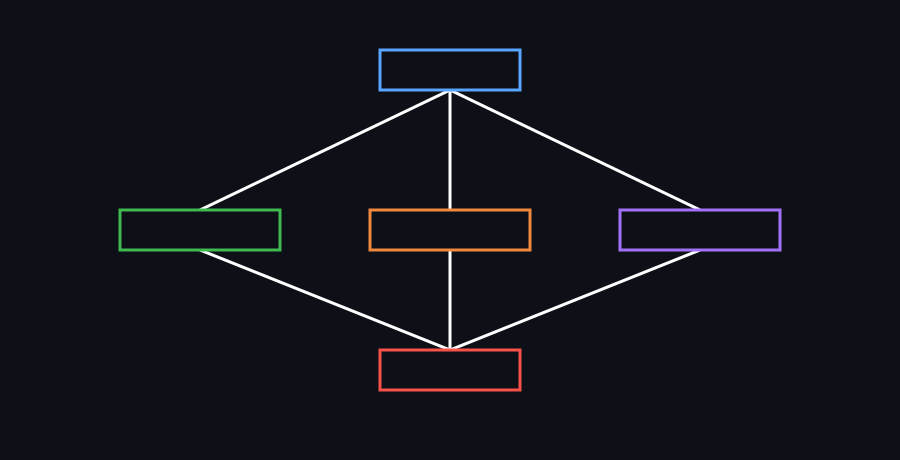
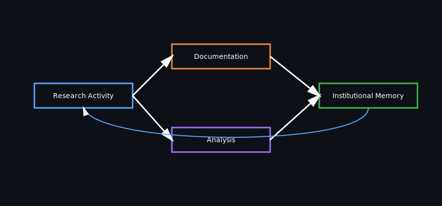
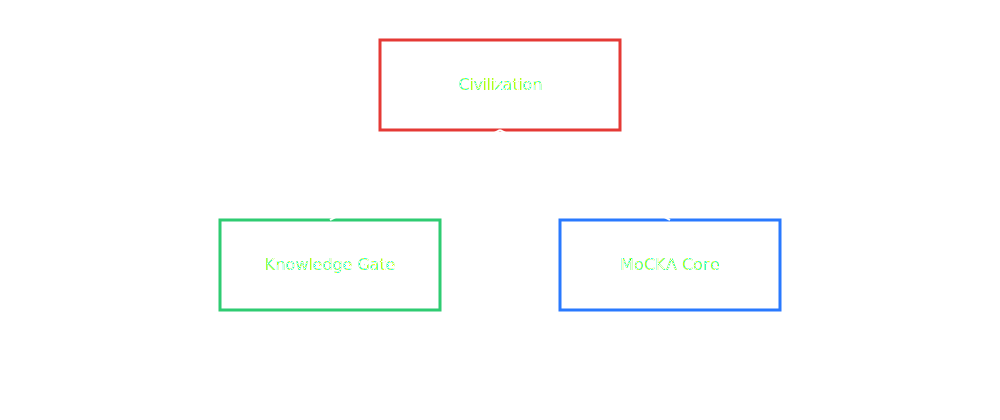

# MoCKA Knowledge Gate

## Institutional Memory Infrastructure of the MoCKA Insight System

MoCKA Knowledge Gate is the institutional memory infrastructure of the MoCKA Insight System.

It preserves research reasoning, governance context, and verification artifacts required to reconstruct verifiable AI governance research.

---

## Knowledge Gate Architecture

The Knowledge Gate functions as the institutional memory layer of the MoCKA Insight System.

Research execution, verification, knowledge integration, and governance are structurally connected through this architecture.

---

## Why Knowledge Gate Exists

AI governance research produces complex reasoning processes and decision contexts.

Without structured preservation, institutional knowledge disappears.

Typical failure modes include:

- loss of reasoning traces
- disappearance of governance context
- irreproducible research results
- fragmentation of institutional knowledge

Knowledge Gate prevents these failures by preserving structured research artifacts.

---

## Knowledge Preservation Model

Research artifacts become institutional memory through documentation and archival.

Knowledge is not static storage.

Artifacts accumulate as institutional memory and become the foundation for future research cycles.

---

## Research Knowledge Flow

Research activities produce artifacts that are verified and archived as institutional memory.

Archived knowledge accumulates and forms the base for the next research cycle.

The system forms a continuous loop where knowledge is produced, verified, accumulated, and reused.

---

## Repository Structure

MoCKA Knowledge Gate stores structured institutional memory artifacts used across the MoCKA Insight System.

---

## Institutional Memory Structure

Institutional memory is organized into several knowledge domains.

Each domain preserves a different aspect of the research lifecycle and governance structure.

---

## Stored Artifacts

Knowledge Gate preserves multiple categories of institutional research artifacts:

- architecture documentation
- research maps
- governance frameworks
- decision context
- verification reports

These artifacts together form the persistent institutional memory layer of the MoCKA Insight System.

---

## Related Repositories

| System Layer | Description | Repository |
|--------------|-------------|------------|
| **MoCKA Core** | Research execution engine |  |
| **Knowledge Gate** | Institutional memory infrastructure |  |
| **Transparency** | Verification and audit layer |  |
| **External Brain** | Knowledge integration layer |  |
| **Civilization** | Governance philosophy framework |  |

These repositories together form the MoCKA Insight System architecture.

---

## Summary

MoCKA Knowledge Gate functions as the institutional memory infrastructure of the MoCKA Insight System.

It preserves research reasoning, governance context, and verification artifacts required to ensure that AI governance research remains transparent, traceable, and reproducible.

Knowledge is not merely stored; it is accumulated, structured, and reused across research cycles.

