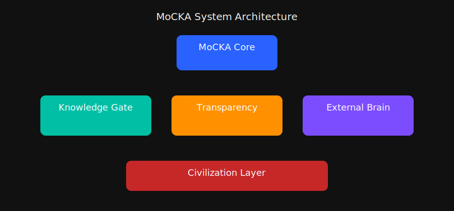
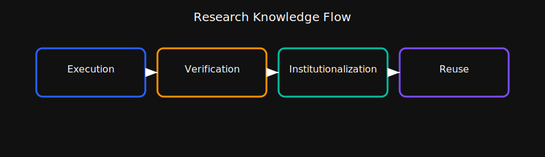

# MoCKA Knowledge Gate

MoCKA Knowledge Gate は、MoCKA Insight System の中で研究の推論や判断、検証の文脈を整理し、未来の研究に再利用できる形で保存する制度的記憶レイヤーです。

## Knowledge Gate (EN)

## Knowledge Gate (JP)

## System Architecture (Outline Night)

## Research Flow (Outline Night)

## SVG Assets List
(see notes/svg_list_note.md)
