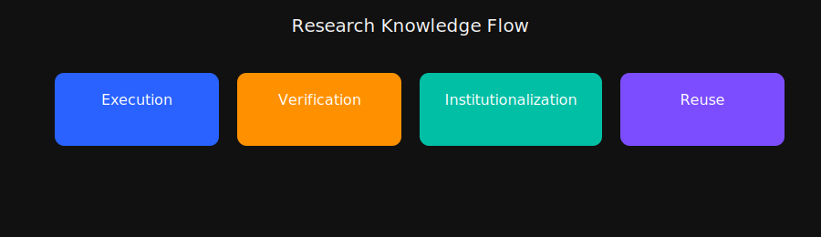
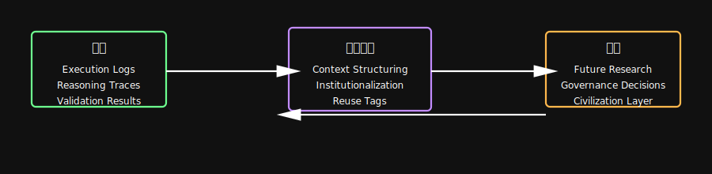
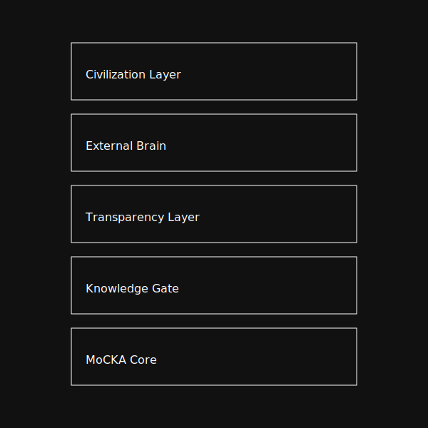

# MoCKA Knowledge Gate（Test Read）

MoCKA Knowledge Gate は、MoCKA Insight System 全体の中で、研究の推論や判断、検証の文脈を整理し、未来の研究に再利用できる形で保存する制度的記憶レイヤーです。MoCKA Core で生まれた推論やログを受け取り、Transparency Layer で検証された内容を取り込み、研究の文脈を体系化して蓄積します。

Knowledge Gate は、MoCKA 全体の中で研究の記憶を長期的に保持し、次の研究や制度設計に渡す中枢として機能します。

---

# System Architecture（MoCKA 全体の中での位置づけ）

MoCKA Insight System は複数のレイヤーで構成され、研究の実行から検証、記憶、再利用までを循環させる仕組みを持ちます。

- MoCKA Core：研究実行と一次成果物の生成  
- Knowledge Gate：推論や判断の文脈を保存し制度化する  
- Transparency Layer：監査と検証可能性の提供  
- External Brain：外部知識との統合  
- Civilization Layer：ガバナンス思想や制度設計の保持  

Knowledge Gate はこの中で、研究の文脈を受け取り、整理し、未来に渡す役割を担います。

---

## MoCKA Civilization System Map

MoCKA Insight System の全体構造は、研究文明の流れとして整理することができます。  
Civilization から始まり、External Brain を通じて研究が実行され、Evidence が生成され、  
Transparency によって検証され、Knowledge Gate によって制度的記憶として保存されます。

この流れは単なる処理パイプラインではなく、研究文明を構成する制度的な構造として設計されています。

---

# Research Knowledge Flow（知識の流れ）

Knowledge Gate は MoCKA の知識循環の中心にあります。

1. Execution：MoCKA Core が研究を実行し、推論やログを生成する  
2. Verification：Transparency Layer が内容を検証する  
3. Institutionalization：Knowledge Gate が文脈を整理し制度的記憶として保存する  
4. Reuse and Governance：保存された知識が次の研究や制度設計に活用される  

この循環により、MoCKA Insight System は積み上がる研究文明として進化します。

---

## Knowledge Generation Cycle

MoCKA Insight System では、研究知識は直線的に終わるのではなく、循環する構造を持ちます。  
Execution によって研究が実行され、Verification によって検証され、  
Institutionalization によって制度的記憶として保存され、  
Reuse によって次の研究に再利用されます。

この循環により、研究は単発の成果ではなく、積み上がる文明として成長します。

---

# Knowledge Gate の重要性

一般的な AI は文脈を忘れ、推論の根拠を残さず、同じ質問でも回答が変わるため、長期的な研究には向きません。Knowledge Gate はこれを補完し、研究の再現性を保証し、誤解や暴走を制度的に抑制し、研究成果を文明レベルで蓄積します。

---

## MoCKA Knowledge Infrastructure

Knowledge Gate は単独で機能するものではなく、  
Experiment Registry、Verification System、Research Map、Repository Ecosystem、AI Agents  
といった複数の制度インフラと連携して動作します。

これらのシステムは Knowledge Generation Cycle の外側に配置され、  
研究の実行、検証、保存、再利用を支える制度的基盤として機能します。

---

# 進化中のプロジェクトとしての位置づけ

Knowledge Gate は完成形ではなく、MoCKA Insight System の成長に合わせて進化し続けます。新しい研究プロセスや検証手法の追加、文脈保存の精度向上、外部脳との連携強化など、柔軟に拡張されるレイヤーです。

---

# Knowledge Gate の補足説明（SVG と連動）

Knowledge Gate は、MoCKA Insight System の中で研究の文脈を受け取り、整理し、未来の研究に渡す役割を持つが、その働きは文章だけでは分かりにくい部分がある。そこで補足として、Knowledge Gate が扱う情報の流れを三つの視点で整理する。

一つ目は、研究実行で生まれた情報がどのように Knowledge Gate に入り、どのように処理され、どこへ渡されるのかという流れである。入力としては実行ログ、推論の痕跡、検証結果などがあり、Knowledge Gate の内部では文脈の整理や制度化が行われ、出力として次の研究や制度設計に使われる情報が生成される。

二つ目は、MoCKA Insight System 全体の中で Knowledge Gate がどの位置にあるかという視点である。MoCKA Core、Transparency Layer、External Brain、Civilization Layer といった複数のレイヤーの中で、Knowledge Gate は研究の文脈を受け取り、制度的記憶として保持する中心的な位置にある。

三つ目は、研究知識が循環する仕組みである。研究の実行、検証、制度化、再利用という流れが循環し、MoCKA Insight System 全体が積み上がる研究文明として成長していく。この循環の中で Knowledge Gate は制度的記憶の役割を担い、研究の再現性と継続性を支えている。

---

# MoCKA Knowledge Gate とは何か

MoCKA Knowledge Gate は、MoCKA Insight System の中で、研究の推論や判断、検証の文脈を受け取り、整理し、次の研究や制度設計に使える形で残すためのレイヤーです。通常の AI がその場限りの応答で終わるのに対して、Knowledge Gate は「研究の流れと背景を記録し続ける仕組み」として働きます。

---

# MoCKA 全体の中での位置づけ

MoCKA Insight System は、研究を実行する MoCKA Core、検証を行う Transparency Layer、外部知識とつながる External Brain、長期的なガバナンスを扱う Civilization Layer などで構成されています。Knowledge Gate はその中で、Core と Transparency から渡された情報を受け取り、後から参照できる形で整理しておく役割を担います。

---

# 情報の流れ

Knowledge Gate に入ってくるのは、実行ログ、推論の流れ、検証結果といった情報です。これらをまとめて文脈ごとに整理し、次の研究や判断に使える「制度的な記録」として残します。整理された情報は、次の研究計画や見直し、制度設計の前提として再利用されます。

---

# 知識の循環の中での役割

MoCKA では、研究の実行、検証、記録、再利用が繰り返されることで、知識が積み上がっていきます。Knowledge Gate はその循環の中で、文脈を失わない形で記録を残す部分を担当しており、同じ失敗や同じ検証を繰り返さないための土台として機能します。

---

# Knowledge Gate 補足図版

### Knowledge Gate フロー図

### MoCKA Insight System 全体レイヤー図

### Research Knowledge Flow 図
